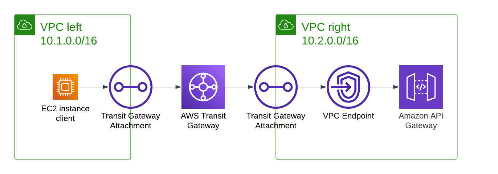

# Network Troubleshooting

## Introduction

Topology and resources used for our talk at the AWS Community Day DACH 2022: **Wenn selbst ‘erlaube allen Verkehr von 0.0.0.0/0’ nicht hilft - Verbindungsprobleme in AWS lösen**.

## Topology

The topology consists of two VPCs and some resources inside:



All resources are tagged with `Trouble=yes` so that they can be easily found.

## TGW Metrics

A CloudWatch Dashboard for Transit Gateway metrics is automatically created.
Its URL can be retrieved via

```
terraform output metrics_dashboard_url
```

## Packet Mirroring

### Usage

```bash
mkfifo dump.fifo
ssh $(terraform output topology_client_instance_id) 'sudo tcpdump -U -i ens5 -w -' > dump.fifo &
wireshark -k -i dump.fifo
```

- for capturing on client instance, use `terraform output topology_client_instance_id`
- for capturing with VPC Traffic Mirroring on target, use `terraform output packet_capture_receiver_instance_id`
### Troubleshooting

Replacing the `capture-receiver` instance fails with

```
module.packet_mirroring.aws_ec2_traffic_mirror_target.this: Destroying... [id=tmt-xxxxxxxxxx]
╷
│ Error: deleting EC2 Traffic Mirror Target (tmt-xxxxxxxxxx): TrafficMirrorTargetInUse: Cannot delete tmt-0df010bc9a30a23a2. Target is in use by tms-0616693091249136d
│       status code: 400, request id: xxxxxxxxxx
│ 
│ 
╵

```

Terraform falsely wants to update the mirror session in place. Resolution:

```
$ terraform taint module.packet_mirroring.aws_ec2_traffic_mirror_session.this
```